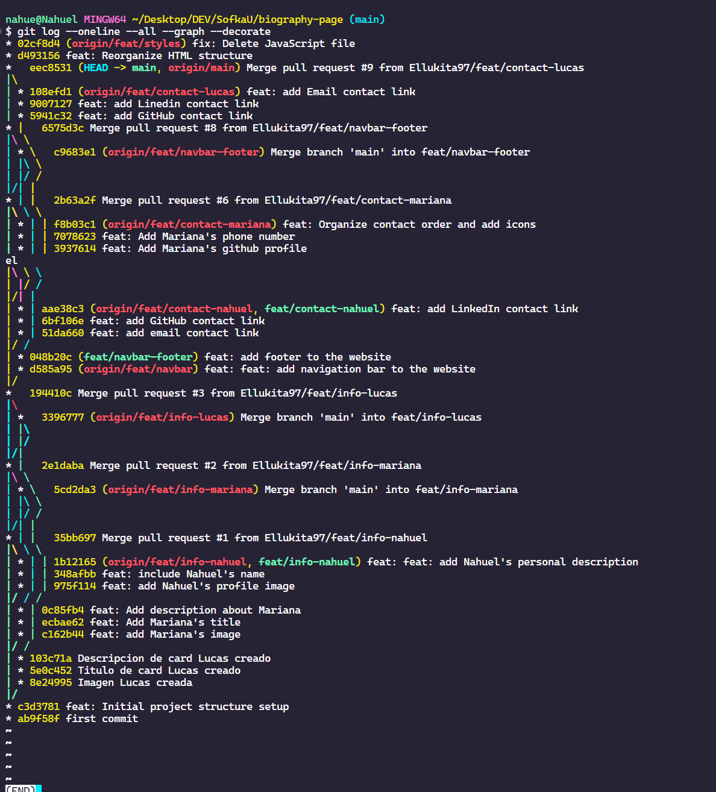
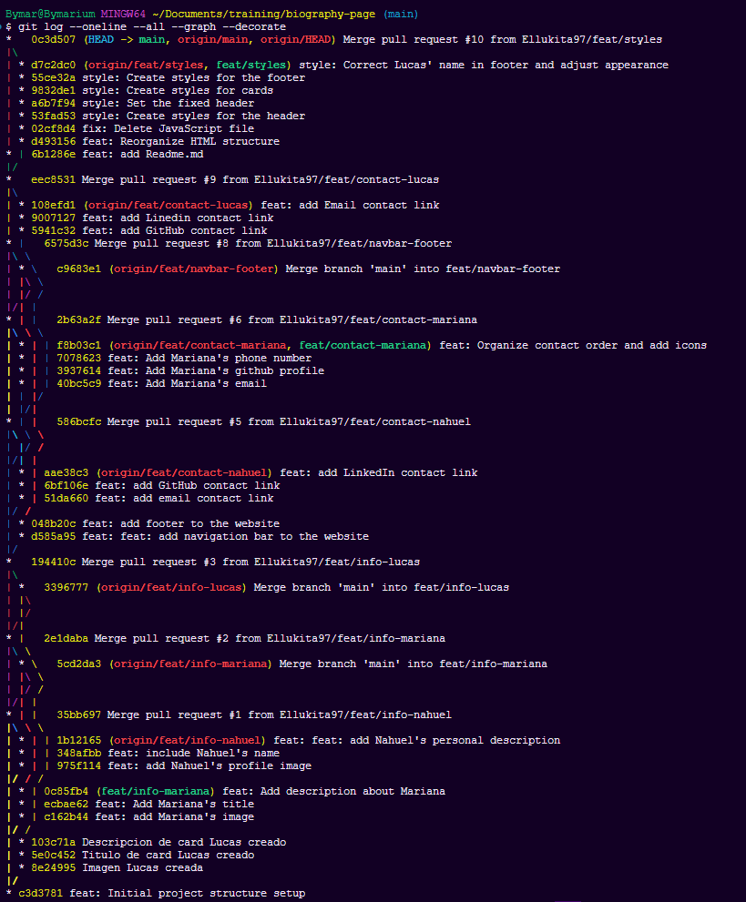
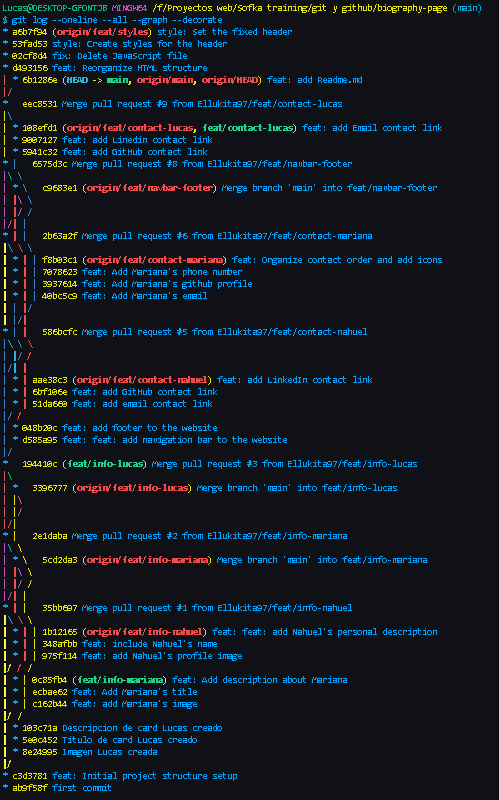

# Biography Page

This is a simple biography webpage that showcases brief biographies, photos, and contact information for three contributors: Mariana Usuga, Nahuel Lemes, and Lucas Gonzalez.

## Features

- *Navigation Bar*: 
  - Provides links to quickly navigate to each biography section.
- *Biographies*: 
  - Each section includes a photo, description, and contact links for each individual.
- *Footer*:
  - Displays copyright information including the year and creator credits.

## Technologies Used

- HTML5
- CSS3

## Project Structure

```
project-folder/
├── index.html         # Main HTML file
├── assets/            # Folder containing images and stylesheets
│   ├── styles.css     # CSS for styling the webpage
│   └── img/           # Images for the biographies
└── README.md          # Project documentation
```

## Contributors

- *Mariana Usuga*  
  - Email: [bymarium@gmail.com](mailto:bymarium@gmail.com)  
  - GitHub: [@bymarium](https://github.com/bymarium)  
  
- *Nahuel Lemes*  
  - Email: [nahulem@gmail.com](mailto:nahulem@gmail.com)  
  - GitHub: [@NahuLemesF](https://github.com/NahuLemesF)  
  - LinkedIn: [Nahuel Lemes](https://www.linkedin.com/in/ellukita97)  
  
- *Lucas Rodrigues*  
  - Email: [ebengarden@gmail.com](mailto:ebengarden@gmail.com)  
  - GitHub: [@Ellukita97](https://github.com/Ellukita97)  
  - LinkedIn: [Lucas Rodrigues](https://www.linkedin.com/in/ellukita97)  

## Git Workflow Captures

Below are the captures of the project's Git graph showing the commit history and branch structure:


1. *Nahuel's Git Graph*
   
   

2. *Mariana's Git Graph*
   
   

3. *Lucas Git Graph*
   
   


## How to Run the Project

1. Clone the repository:
   bash
   git clone https://github.com/Ellukita97/biography-page.git
   
2. Navigate to the project folder:
   bash
   cd biography-page
   
3. Open the index.html file in your browser:
   bash
   open index.html
   

## Live Preview

The project is hosted on GitHub Pages. You can view it [here](https://ellukita97.github.io/biography-page/).
   

---

© 2024 - Biographies - Created by Mariana Usuga, Nahuel Lemes, and Lucas Rodrigues.
